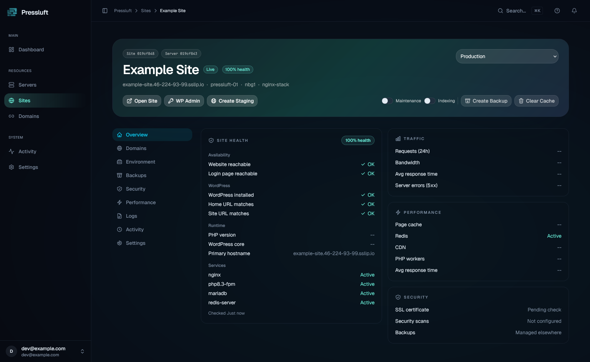

# Pressluft

Self-hosted WordPress hosting panel for web agencies.

> **⚠️ Highly experimental.** This project is not ready for production use. But you can change that. Join the team!



## What I'd love to build

Professional WordPress hosting platforms like WP Engine, Cloudways, Kinsta, and Raidboxes give agencies a complete workflow — staging environments, push-to-live, server management, site monitoring, backups, updates and way more.

Pressluft is the attempt to build that same experience as open-source software you run yourself. Self-hosted, on infrastructure you own, with the same kind of polish a professional agency workflow requires.

## What I think it could do

- Provision servers on any major cloud provider and pick a pre-configured stack — e.g. NGINX, OpenLiteSpeed, or WooCommerce-optimized — including hardened WordPress configuration and security defaults out of the box
- Access server-side optimizations like caching, Redis, image optimization, firewall and more without relying on WordPress plugins
- Deploy new WordPress sites instantly to existing domains or a sandbox
- Create staging environments and push changes to live with one click
- Create automatic remote backups to any S3-compatible storage
- Migrate existing WordPress sites into the management panel
- Update plugins, themes, and WordPress core automatically with rollbacks on failure
- Spin up a local development environment with one command and connect it to your staging site

I'm sure all of you have 101 more features that fit your agency workflow.

## Security

Security is a core concern for a tool that manages production infrastructure. Here is what the current implementation does:

- SSH private keys and the certificate authority key are encrypted at rest using [age](https://age-encryption.org)
- The control plane acts as its own certificate authority (ECDSA P-256)
- In production, agents authenticate to the control plane using mTLS — each agent gets a client certificate signed by the control plane CA on first registration
- In dev mode, token-based auth is used instead so you don't need to deal with certificates locally

## Get involved

This should be a community project from WordPress professionals for WordPress professionals. If you've made it this far, you probably know exactly what your workflow needs. Help shape what this becomes.

The codebase is split into three main areas by discipline, so you can contribute in the part you know best without having to work through the whole thing:

- `web/` — a standard Nuxt 3 app. If you know Vue, you can work on the dashboard without touching any Go.
- `internal/` — the Go backend: API, job orchestration, agent communication, and the security layer. This is where the core business logic lives.
- `ops/` — Ansible playbooks, server profiles, and scripts. If you are a sysadmin or infrastructure person, this is your world.

Open an issue, start a discussion, send a PR, or write to [deniz@bombig.net](mailto:deniz@bombig.net).

## Get started

Use a Unix-like environment (Ubuntu, macOS, or WSL2). Development is tested on Ubuntu 24.04 in WSL2 on Windows 11. Feedback to other environments welcome!

**Install required tools:**

- [Go 1.24+](https://go.dev/dl/)
- [Node.js 20+](https://nodejs.org/)
- [pnpm](https://pnpm.io/installation)
- [cloudflared](https://developers.cloudflare.com/cloudflare-one/connections/connect-networks/downloads/)

**Set up project dependencies** from the repository root:

```bash
python3 -m venv .venv
source .venv/bin/activate
pip install ansible
ansible-galaxy collection install -r ops/ansible/requirements.yml
```

## Development

```bash
make dev
```

This starts the Go backend on `http://localhost:8081`, the Nuxt dev server on `http://localhost:8080`, and a Cloudflare quick tunnel so provisioned servers can reach your local control plane.

## Building

```bash
make build   # control plane — builds bin/pressluft with embedded dashboard
make agent   # agent binary — statically linked, for deployment to managed servers
make all     # both
```
